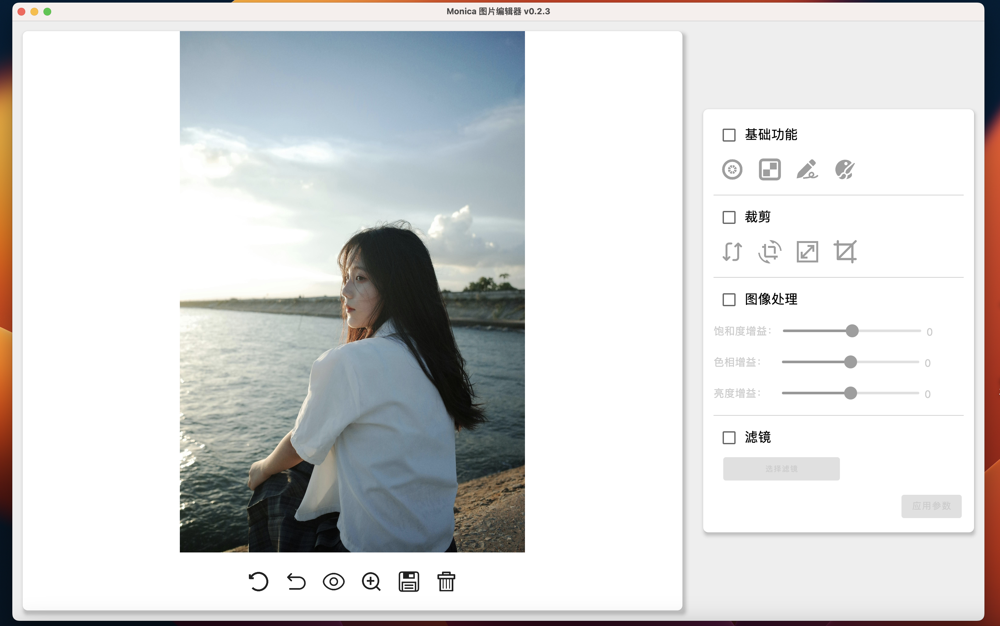
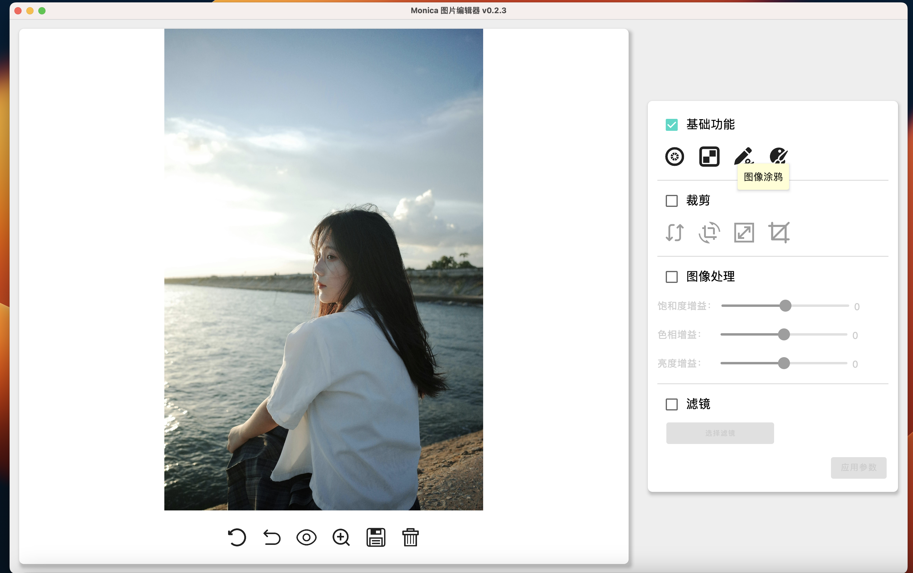

# Monica
Monica 是一款跨平台的桌面图像编辑软件，使用 Kotlin Compose Desktop 进行开发。

它基于 mvvm 架构，由于应用层都是由 Kotlin 编写的，所以使用 koin 作为依赖注入框架。

# 一. 简介
Monica 目前还处于开发阶段，当前版本的主要功能包括：

* 支持加载本地图片、网络图片。
* 支持对图片进行局部模糊、打马赛克。
* 支持对图片进行涂鸦，并保存涂鸦的结果。
* 支持图片取色功能
* 支持图像的翻转、旋转、缩放
* 支持各种形状的裁剪，并保存裁剪的结果。
* 调整图片的饱和度、色相、亮度。
* 提供 20 多款滤镜，大多数滤镜可以单独调整参数。
* 保存修改的图像。

# 二. 功能

## 2.1 基础功能
加载完图像后，可以对图像进行各种编辑

很多按钮，都带有 tooltips，例如这个涂鸦功能

点击按钮就可以进入涂鸦界面，对图像进行随意的涂鸦。

由于是桌面软件，画笔由鼠标进行控制。画笔默认是黑色的，可以随着鼠标的移动而进行绘制曲线。

## 2.2 裁剪

## 2.3 图像处理

## 2.4 滤镜

# 三. 更多详情

可以查看：

https://juejin.cn/post/7365711904159612954

https://juejin.cn/post/7374238968685920282

# TODO List：

* 增加对图像添加文字的功能。
* 优化部分算法，提高效率。
* 考虑增加人脸美颜的算法。
* 考虑实现多图的导入。